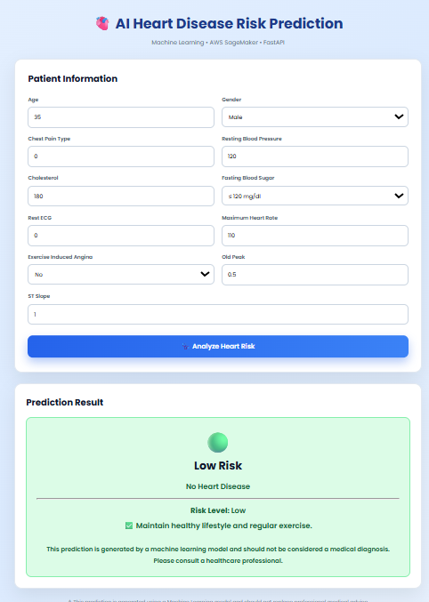
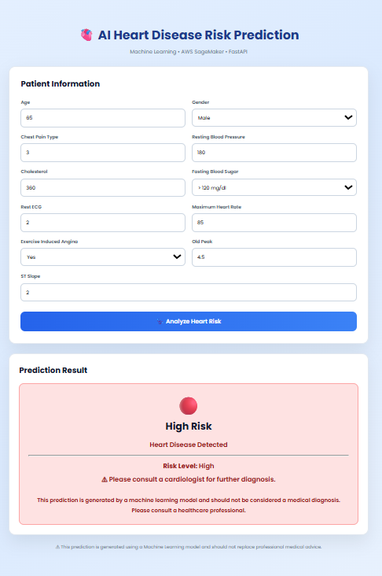

# ❤️ AWS MLOps Heart Disease Predictor


<p align="center">


</p>

<p align="center">
Predict Heart Disease using Machine Learning, FastAPI and AWS SageMaker with an End-to-End MLOps Pipeline.
</p>

---

# 📖 About the Project

Heart disease is one of the leading causes of death around the world. Early prediction can help doctors and patients make better medical decisions.

This project is an **End-to-End AWS MLOps solution** that predicts whether a patient is likely to have heart disease based on clinical information.

The complete pipeline includes:

- Data preprocessing
- Model training
- Amazon S3 storage
- Amazon SageMaker training
- Model deployment
- FastAPI integration
- Live prediction through a web application

The trained model achieves approximately **92% prediction accuracy**.

---

# 🌐 Live Demo

### 🚀 Website

👉 **https://heart.vinaysharmatech.xyz/**

---

# ✨ Key Features

- ❤️ Heart Disease Prediction
- 🤖 Random Forest Machine Learning Model
- ☁️ AWS SageMaker Training
- 📦 Amazon S3 Dataset Storage
- ⚡ FastAPI REST API
- 🚀 Real-Time Prediction
- 🌍 Live Deployment
- 📊 Around 92% Prediction Accuracy
- 🔄 End-to-End MLOps Workflow

---

# 🏗️ System Architecture

```
Patient Information
        │
        ▼
 Web Application
        │
        ▼
     FastAPI API
        │
        ▼
 AWS SageMaker Endpoint
        │
        ▼
 Random Forest Model
        │
        ▼
 Prediction Result
```

---

# 📊 Dataset

This project uses two publicly available Heart Disease datasets to build a robust and reliable prediction model.

### 📁 Dataset 1 – Heart Disease UCI Dataset

- **Filename:** `heart.csv`
- **Records:** 303 (approximately 302–303 patient records)
- **Purpose:** Used as the original benchmark dataset for data exploration, preprocessing, and initial model evaluation.

### 📁 Dataset 2 – Heart Disease Combined Dataset

- **Filename:** `heart_1190.csv`
- **Records:** 1,190 patient records
- **Purpose:** A larger combined dataset used for final model training to improve prediction performance and generalization.

The project workflow started with the original Heart Disease UCI dataset and later moved to the larger combined dataset for training the production model. This helped the model learn from a more diverse set of patient records and achieve better prediction performance.

### 🩺 Input Features

- Age
- Sex
- Chest Pain Type
- Resting Blood Pressure
- Cholesterol
- Fasting Blood Sugar
- Resting ECG
- Maximum Heart Rate
- Exercise Induced Angina
- Oldpeak
- ST Slope
- Number of Major Vessels (CA)
- Thalassemia (Thal)

### 🎯 Target Variable

- **0 → No Heart Disease**
- **1 → Heart Disease**
### Target

- **0 → No Heart Disease**
- **1 → Heart Disease**

---

# 🧹 Data Preprocessing

Before training, the data goes through several preprocessing steps:

- Cleaning the dataset
- Handling missing values
- Feature selection
- Encoding categorical values
- Preparing data for training
- Uploading processed dataset to Amazon S3

---

# 🤖 Machine Learning Model

### Algorithm Used

✅ Random Forest Classifier

### Why Random Forest?

- High Accuracy
- Less Overfitting
- Handles Complex Data
- Fast Prediction
- Reliable for Healthcare Data

### Model Accuracy

**≈ 92%**

---

# ☁️ AWS Services Used

| Service | Purpose |
|----------|----------|
| Amazon S3 | Dataset & Model Storage |
| Amazon SageMaker | Model Training |
| SageMaker Endpoint | Real-Time Prediction |
| IAM | Secure Access |
| CloudWatch | Monitoring |
| Boto3 | AWS Integration |

---

# ⚡ FastAPI Integration

The project uses **FastAPI** to build a REST API.

The API receives patient information from the frontend, sends it to the deployed SageMaker endpoint, and returns the prediction result instantly.

---

# 🔄 Project Workflow

```
Load Dataset

      │

      ▼

Data Preprocessing

      │

      ▼

Upload Dataset to Amazon S3

      │

      ▼

Train Model using SageMaker

      │

      ▼

Save Trained Model

      │

      ▼

Deploy SageMaker Endpoint

      │

      ▼

FastAPI REST API

      │

      ▼

Live Web Application

      │

      ▼

Heart Disease Prediction
```

---

# 🛠️ Technologies Used

- Python
- FastAPI
- Uvicorn
- Scikit-Learn
- Pandas
- NumPy
- Joblib
- Boto3
- Amazon SageMaker
- Amazon S3
- HTML
- CSS
- JavaScript

---

# 📂 Project Structure

```
AWS-MLOps-Heart-Disease-Predictor/

│── notebook/
│   └── Updatetrainingcode.ipynb
│
│── app.py
│── train.py
│── inference.py
│── requirements.txt
│
│── screenshots/
│   ├── Home.png
│   ├── Output1.png
│   ├── Output2.png
│   ├── Output3.png
│   ├── S3.png
│   ├── Training.png
│   └── Endpoint.png
│
│── README.md
```

---

# 📸 Project Output

### 📊 Prediction Output 1


---

### 📊 Prediction Output 2



---

### 📊 Prediction Output 3



---

### ☁️ Amazon S3

> Add image: **S3.png**

---

### 🤖 SageMaker Training

> Add image: **Training.png**

---

### 🚀 SageMaker Endpoint

> Add image: **Endpoint.png**

---

# 🚀 Installation

Clone the repository

```bash
git clone https://github.com/009vinaysharma/AWS-MLOps-Heart-Disease-Predictor.git
```

Move into project

```bash
cd AWS-MLOps-Heart-Disease-Predictor
```

Install dependencies

```bash
pip install -r requirements.txt
```

Run FastAPI

```bash
uvicorn app:app --reload
```

---

# 📚 What I Learned

During this project I learned:

- AWS SageMaker
- Amazon S3
- Model Deployment
- FastAPI Development
- Machine Learning Deployment
- End-to-End MLOps
- REST API Development
- Cloud-Based ML Workflow

---

# 🔮 Future Improvements

- Docker Support
- MLflow Integration
- CI/CD Pipeline
- Model Monitoring
- Automatic Retraining
- Authentication
- Better UI
- Dashboard Analytics

---

# 👨‍💻 Developer

## Vinay Sharma

**B.Tech Computer Science (Artificial Intelligence)**

Arya College of Engineering & IT, Jaipur

### 💻 GitHub

https://github.com/009vinaysharma

### 🚀 Live Project

https://heart.vinaysharmatech.xyz

---

# ⭐ Support

If you found this project useful,

⭐ Star this Repository

🍴 Fork it

💙 Share it with others

---

## Thank You ❤️
