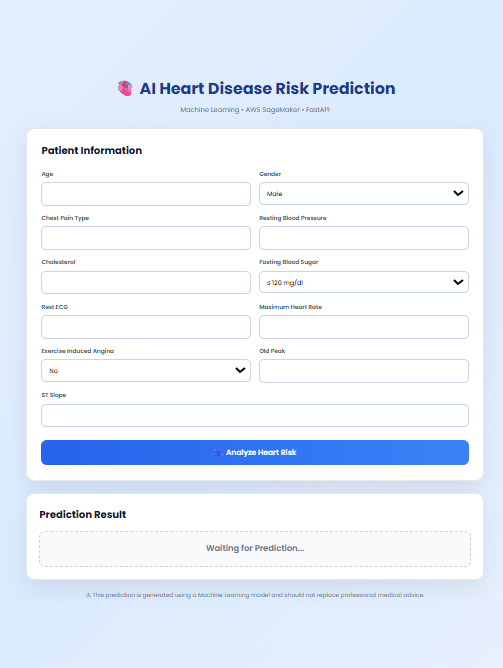

# ❤️ AWS MLOps Heart Disease Prediction System

<p align="center">


</p>

---

# ❤️ Project Description

The **AWS MLOps Heart Disease Prediction System** is a complete end-to-end Machine Learning deployment project developed using modern **MLOps** practices on **Amazon Web Services (AWS)**.

The goal of this project is to predict whether a patient is at risk of heart disease using various medical attributes such as age, cholesterol level, blood pressure, chest pain type, ECG results, maximum heart rate, exercise-induced angina, and other clinical parameters.

Unlike traditional Machine Learning projects that stop after model training, this project demonstrates the **complete production deployment pipeline**, including:

- Data Preparation
- Model Training
- Cloud Storage
- SageMaker Model Deployment
- REST API Development
- Docker Containerization
- EC2 Deployment
- Reverse Proxy Configuration
- HTTPS Security
- Custom Domain Integration

The project follows an industry-standard deployment workflow, making it suitable for understanding real-world Machine Learning Operations (MLOps) concepts.

---

# 🎯 Problem Statement

Heart disease remains one of the leading causes of death across the world.

Early prediction of cardiovascular disease can help healthcare professionals identify high-risk patients and make informed medical decisions before severe complications occur.

This application allows users to enter a patient's medical information through a responsive web interface and instantly receive a prediction indicating whether the patient is likely to have heart disease.

The prediction is generated using a Machine Learning model deployed on AWS SageMaker and accessed through FastAPI REST APIs.

---

# 🚀 Live Application

| Service | Link |
|---------|------|
| 🌐 Frontend | https://heart.vinaysharmatech.xyz |
| 📖 Swagger Documentation | https://heart.vinaysharmatech.xyz/docs |
| ❤️ Prediction API | https://heart.vinaysharmatech.xyz/predict |
| 🩺 Health Check | https://heart.vinaysharmatech.xyz/health |

---

# 📚 Table of Contents

- Project Description
- Problem Statement
- Live Application
- Key Features
- System Architecture
- Technologies Used
- AWS Services Used
- Dataset
- Machine Learning Model
- Complete Project Journey
- API Endpoints
- Project Structure
- Prediction Results
- Challenges Faced
- Future Improvements
- Installation Guide
- Author

---

# ✨ Key Features

- ✅ End-to-End Machine Learning Pipeline
- ✅ Heart Disease Risk Prediction
- ✅ FastAPI REST API
- ✅ AWS SageMaker Integration
- ✅ Amazon EC2 Deployment
- ✅ Docker Containerization
- ✅ Amazon S3 Integration
- ✅ Nginx Reverse Proxy
- ✅ HTTPS using Let's Encrypt SSL
- ✅ Responsive Frontend
- ✅ Production-Ready Architecture

---

# 🏗️ Complete System Architecture

```text
                          User
                            │
                            ▼
                 HTML • CSS • JavaScript
                            │
                            ▼
                 HTTPS (Custom Domain)
                            │
                            ▼
                         Nginx
                            │
                            ▼
                    FastAPI REST API
                            │
                            ▼
                 Docker Container (EC2)
                            │
                            ▼
                AWS SageMaker Endpoint
                            │
                            ▼
                Random Forest Classifier
                            │
                            ▼
                   Prediction Response
```

---

# 🛠️ Technologies Used

## 💻 Programming Languages

- Python
- HTML5
- CSS3
- JavaScript

---

## 🤖 Machine Learning

- Scikit-Learn
- Pandas
- NumPy
- Joblib

---

## ⚡ Backend

- FastAPI
- Uvicorn
- Pydantic

---

## ☁️ Cloud Services

- Amazon EC2
- Amazon SageMaker
- Amazon S3
- AWS IAM

---

## 🚀 DevOps & Deployment

- Docker
- Git
- GitHub
- Nginx
- Certbot SSL

---

# ☁️ AWS Services Used

| AWS Service | Purpose |
|-------------|---------|
| Amazon S3 | Store dataset and model artifacts |
| Amazon SageMaker | Train and deploy Machine Learning model |
| Amazon EC2 | Host Docker container and FastAPI backend |
| AWS IAM | Manage permissions securely |
| Nginx | Reverse Proxy |
| Let's Encrypt | HTTPS SSL Certificate |

---

# 📊 Dataset

### Dataset Used

Heart Disease UCI Dataset

### Number of Features

13

### Target Variable

Heart Disease (0 / 1)

### Input Features

- Age
- Sex
- Chest Pain Type
- Resting Blood Pressure
- Cholesterol
- Fasting Blood Sugar
- Rest ECG
- Maximum Heart Rate
- Exercise Induced Angina
- Oldpeak
- Slope
- Number of Major Vessels
- Thalassemia

---

# 🤖 Machine Learning Model

### Model Used

Random Forest Classifier

### Why Random Forest?

- High Prediction Accuracy
- Handles Non-linear Relationships
- Reduces Overfitting
- Performs well on Medical Datasets
- Fast Prediction Speed
- Robust against Noise

# 🚀 Complete Project Journey

## 📌 Step 1 — Dataset Collection

The project began with collecting the **Heart Disease UCI Dataset**, a widely used benchmark dataset for cardiovascular disease prediction. The dataset contains various medical attributes such as age, cholesterol level, resting blood pressure, chest pain type, ECG results, maximum heart rate, and exercise-induced angina.

The objective was to use these clinical parameters to predict whether a patient is likely to have heart disease.

---

## 📌 Step 2 — Data Preprocessing

Raw datasets are rarely suitable for direct model training.

Before training the model, the dataset was carefully preprocessed to improve data quality and ensure better prediction performance.

The preprocessing pipeline included:

- Data Cleaning
- Handling Missing Values
- Feature Verification
- Data Formatting
- Target Variable Validation
- Final Dataset Preparation

The processed dataset was saved as:

```text
heart_prepared.csv
```

---

## 📌 Step 3 — Machine Learning Model Training

After preprocessing, the dataset was divided into training and testing datasets.

The Machine Learning model was trained using the **Random Forest Classifier**, which is well suited for tabular medical datasets because of its robustness and strong classification performance.

Training workflow:

- Import dataset
- Split features and target
- Train Random Forest model
- Evaluate model performance
- Generate prediction accuracy
- Save trained model using Joblib

Output:

```text
model.joblib
```

---

## 📌 Step 4 — Amazon S3 Storage

Amazon S3 was used as cloud storage for storing project assets.

Items stored inside S3 included:

- Training Dataset
- Model Artifacts
- Files required during SageMaker deployment

Using Amazon S3 makes the deployment process scalable and allows SageMaker to access required files directly from cloud storage.

---

## 📌 Step 5 — SageMaker Training Script

A custom **train.py** script was created for Amazon SageMaker.

Responsibilities:

- Load dataset
- Train Machine Learning model
- Evaluate performance
- Save trained model
- Export model artifacts

Generated Output:

```text
model.tar.gz
```

This artifact is later used during deployment.

---

## 📌 Step 6 — SageMaker Inference Script

A custom **inference.py** file was developed to serve predictions.

Responsibilities:

- Load trained model
- Parse incoming JSON requests
- Convert data into NumPy arrays
- Perform predictions
- Return JSON responses

This script allows SageMaker to expose the Machine Learning model as a real-time prediction endpoint.

---

## 📌 Step 7 — SageMaker Endpoint Deployment

After training completed successfully, the trained model was deployed on **Amazon SageMaker Real-Time Endpoint**.

Instead of loading the model locally, the FastAPI backend sends prediction requests to the SageMaker endpoint.

This architecture follows modern cloud deployment practices and separates model hosting from application hosting.

---

## 📌 Step 8 — Backend Development using FastAPI

A RESTful backend was developed using **FastAPI**.

The backend performs the following operations:

- Accepts patient information
- Validates input data
- Sends prediction requests
- Receives prediction from SageMaker
- Returns JSON response to frontend

FastAPI was selected because of:

- High Performance
- Automatic Swagger Documentation
- Easy API Development
- Production Readiness

---

## 📌 Step 9 — Docker Containerization

To make deployment consistent across environments, the backend application was containerized using Docker.

Docker helped in:

- Packaging dependencies
- Environment consistency
- Easy deployment
- Faster setup
- Better scalability

The FastAPI backend runs completely inside a Docker container on Amazon EC2.

---

## 📌 Step 10 — Amazon EC2 Deployment

An Ubuntu-based Amazon EC2 instance was launched to host the application.

Deployment steps included:

- Installing Docker
- Installing Git
- Cloning GitHub Repository
- Building Docker Image
- Running Docker Container
- Verifying API functionality

The EC2 instance acts as the production server for the application.

---

## 📌 Step 11 — Nginx Reverse Proxy

Nginx was configured as a reverse proxy.

Responsibilities:

- Route frontend requests
- Forward API requests to FastAPI
- Serve static frontend files
- Manage HTTPS traffic
- Improve security and performance

---

## 📌 Step 12 — Custom Domain Configuration

Instead of using the EC2 public IP address, a custom domain was configured.

Domain:

```text
heart.vinaysharmatech.xyz
```

DNS records were updated to point towards the EC2 instance.

This provides a cleaner and more professional user experience.

---

## 📌 Step 13 — HTTPS Security

To secure communication between users and the application, HTTPS was enabled using **Let's Encrypt SSL Certificates**.

Benefits:

- Encrypted Communication
- Secure Data Transfer
- Browser Trust
- Production-Ready Deployment

---

# 🔥 REST API Endpoints

| Method | Endpoint | Description |
|---------|----------|-------------|
| GET | / | API Status |
| GET | /health | Health Check |
| POST | /predict | Heart Disease Prediction |
| GET | /docs | Swagger Documentation |

---

# 📁 Project Structure

```text
AWS-MLOps-Heart-Disease-Predictor/
│
├── backend/
│   ├── app.py
│   ├── predict.py
│   ├── schema.py
│   ├── requirements.txt
│   ├── Dockerfile
│
├── frontend/
│   ├── index.html
│   ├── style.css
│   └── script.js
│
├── dataset/
│   └── heart_prepared.csv
│
├── training/
│   ├── train.py
│   └── inference.py
│
├── model/
│   ├── model.tar.gz
│   └── model-fixed.tar.gz
│
├── screenshots/
│   ├── Output1.png
│   └── Output2.png
│
└── README.md
```

---

# ⚙️ Installation Guide

## Clone Repository

```bash
git clone https://github.com/009vinaysharma/AWS-MLOps-Heart-Disease-Predictor.git
```

---

## Move into Project

```bash
cd AWS-MLOps-Heart-Disease-Predictor
```

---

## Install Dependencies

```bash
pip install -r requirements.txt
```

---

## Run FastAPI

```bash
uvicorn app:app --reload
```

---

## Open Browser

```text
http://127.0.0.1:8000/docs
```

Swagger UI will open automatically.

# 📸 Prediction Results

The following screenshots demonstrate the successful working of the deployed application.

The frontend communicates with the FastAPI backend, which sends prediction requests to the AWS SageMaker endpoint and returns the prediction result in real time.

---

## 💚 Low Risk Prediction

The application successfully predicts that the patient has a **Low Risk** of heart disease based on the entered medical attributes.

<p align="center">

</p>

---

## ❤️ High Risk Prediction

The application successfully predicts that the patient has a **High Risk** of heart disease based on the entered medical attributes.

<p align="center">

</p>

---

# 📈 Project Results

The project was successfully deployed using AWS cloud services and modern MLOps practices.

### Achievements

- ✅ Successfully trained a Machine Learning model for heart disease prediction.
- ✅ Stored datasets and model artifacts on Amazon S3.
- ✅ Deployed the trained model on AWS SageMaker.
- ✅ Developed REST APIs using FastAPI.
- ✅ Containerized the backend using Docker.
- ✅ Hosted the application on Amazon EC2.
- ✅ Configured Nginx as a reverse proxy.
- ✅ Connected a custom domain.
- ✅ Enabled HTTPS using Let's Encrypt SSL.
- ✅ Built a responsive web application for real-time predictions.

---

# 💪 Challenges Faced

During the development and deployment of this project, several real-world challenges were encountered and successfully resolved.

### Machine Learning Challenges

- Preparing the dataset for model training.
- Selecting an appropriate classification algorithm.
- Validating prediction accuracy.
- Creating model artifacts for deployment.

### AWS Challenges

- Uploading datasets to Amazon S3.
- Configuring IAM permissions.
- Deploying and managing SageMaker endpoints.
- Understanding endpoint invocation.

### Backend Challenges

- FastAPI request validation.
- JSON request and response handling.
- Integrating FastAPI with AWS SageMaker.
- API testing using Swagger.

### Docker Challenges

- Docker image creation.
- Dependency management.
- Docker container execution.
- Container networking issues.

### Deployment Challenges

- Configuring Amazon EC2.
- Installing Docker on Ubuntu.
- Managing Linux permissions.
- Running production containers.

### Networking Challenges

- Configuring Nginx Reverse Proxy.
- Connecting custom domain.
- DNS propagation.
- HTTP to HTTPS redirection.
- Resolving Mixed Content errors.

These challenges provided valuable hands-on experience in cloud computing, API development, Docker containerization, production deployment, networking, and modern MLOps workflows.

---

# 🚀 Future Improvements

The project can be extended further by implementing the following features:

- User Authentication
- Prediction History
- Patient Dashboard
- Database Integration
- CloudWatch Monitoring
- CI/CD using GitHub Actions
- Model Versioning
- Kubernetes Deployment
- Auto Scaling
- Multiple Disease Prediction
- Email Report Generation
- Doctor Recommendation System

---

# 📚 Learning Outcomes

Through this project, I gained practical experience in:

- End-to-End Machine Learning Workflow
- Feature Engineering
- Model Deployment
- Amazon Web Services (AWS)
- Amazon SageMaker
- Amazon EC2
- Amazon S3
- Docker Containerization
- FastAPI REST API Development
- Nginx Reverse Proxy
- HTTPS & SSL Configuration
- Linux Server Management
- Git & GitHub
- Production Deployment
- MLOps Best Practices

---

# 📜 License

This project is developed for educational, learning, and portfolio purposes.

You are free to use and modify this project for learning with proper attribution.

---

# 👨‍💻 Author

## Vinay Sharma

**B.Tech – Computer Science with Artificial Intelligence**

Arya College of Engineering , Jaipur

---

### 💻 GitHub

https://github.com/009vinaysharma

### 🔗 LinkedIn

https://www.linkedin.com/in/vinay-sharma-2679a6270/

---

# ⭐ Support

If you found this project helpful, please consider giving this repository a ⭐ on GitHub.

Your support motivates me to build more real-world Machine Learning, AI, Cloud Computing, and MLOps projects.

---

<p align="center">

⭐ Thank you for visiting this repository! ⭐

If you like this project, don't forget to **Star ⭐ the repository**.

</p>
- Suitable for Classification Problems

---
