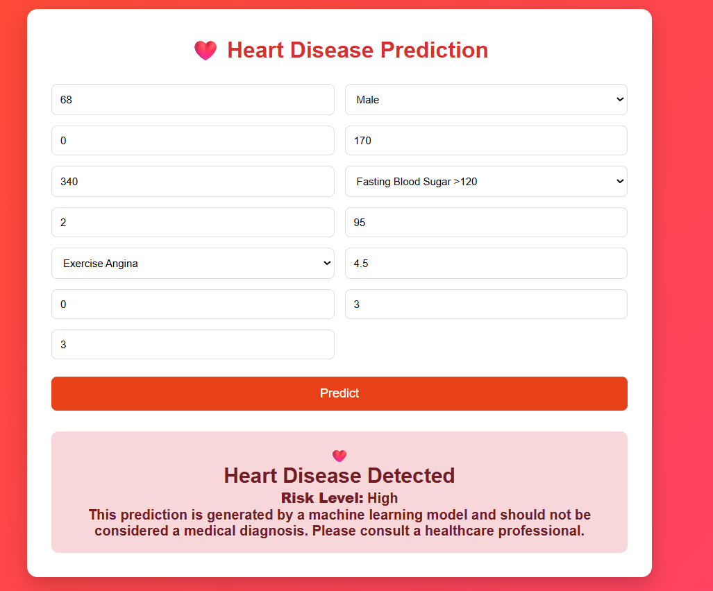

<p align="center">

<h1 align="center">
❤️ AWS MLOps Heart Disease Prediction System
</h1>

<p align="center">
An End-to-End Machine Learning Deployment Pipeline using AWS SageMaker, FastAPI, Docker, EC2, Nginx and MLOps Best Practices.
</p>

<p align="center">


</p>

---

# ❤️ Project Description

The **AWS MLOps Heart Disease Prediction System** is a complete end-to-end Machine Learning deployment project that demonstrates how a predictive model can be transformed into a production-ready cloud application using modern **MLOps** practices.

The objective of this project is to predict the likelihood of heart disease using patient medical information such as age, cholesterol level, blood pressure, ECG results, chest pain type, exercise-induced angina, maximum heart rate, and several other clinical attributes.

Unlike traditional Machine Learning projects that stop after model training, this project covers the complete deployment lifecycle including data preprocessing, model experimentation, cloud storage, model deployment, REST API development, Docker containerization, cloud hosting, HTTPS security, and custom domain configuration.

This project provides practical experience in building scalable Machine Learning systems on Amazon Web Services (AWS).

---

# 🎯 Problem Statement

Heart disease is one of the leading causes of death worldwide.

Early prediction of cardiovascular disease helps doctors identify high-risk patients and enables timely medical intervention.

This application allows users to enter patient health parameters through a responsive web interface and instantly receive predictions generated by a Machine Learning model deployed on AWS SageMaker.

The prediction service is exposed using FastAPI REST APIs and hosted on an AWS production environment.

---

# 🚀 Live Application

| Service | Link |
|---------|------|
| 🌐 Live Application | https://heart.vinaysharmatech.xyz |
| 📖 Swagger Documentation | https://heart.vinaysharmatech.xyz/docs |
| ❤️ Prediction API | https://heart.vinaysharmatech.xyz/predict |
| 🩺 Health Check | https://heart.vinaysharmatech.xyz/health |

---

# 📚 Table of Contents

- Project Description
- Problem Statement
- Live Application
- Key Features
- System Architecture
- Technologies Used
- AWS Services Used
- Dataset
- Machine Learning Model Selection
- Complete Project Journey
- REST APIs
- Project Structure
- Installation Guide
- Prediction Results
- Challenges
- Future Improvements
- Learning Outcomes

---

# ✨ Key Features

- End-to-End Machine Learning Pipeline
- Heart Disease Prediction
- Multiple Model Evaluation
- Best Model Selection
- AWS SageMaker Deployment
- FastAPI REST APIs
- Docker Containerization
- Amazon EC2 Hosting
- Amazon S3 Integration
- Nginx Reverse Proxy
- HTTPS using Let's Encrypt
- Custom Domain Integration
- Responsive Frontend
- Production Ready Deployment

---

# 🏗️ Complete System Architecture

                          User
                            │
                            ▼
                 HTML • CSS • JavaScript
                            │
                            ▼
                 HTTPS (Custom Domain)
                            │
                            ▼
                         Nginx
                            │
                            ▼
                    FastAPI REST API
                            │
                            ▼
                 Docker Container (EC2)
                            │
                            ▼
                AWS SageMaker Endpoint
                            │
                            ▼
                Extra Trees Classifier
                            │
                            ▼
                   Prediction Response

---

# 🛠️ Technologies Used

## Programming Languages

- Python
- HTML5
- CSS3
- JavaScript

## Machine Learning

- Scikit-Learn
- Pandas
- NumPy
- Joblib

## Backend

- FastAPI
- Uvicorn
- Pydantic

## AWS Services

- Amazon S3
- Amazon SageMaker
- Amazon EC2
- AWS IAM

## DevOps

- Docker
- Git
- GitHub
- Nginx
- Certbot SSL

---

# 📊 Dataset

Dataset Used

Heart Disease UCI Dataset

Features

- Age
- Sex
- Chest Pain
- Blood Pressure
- Cholesterol
- Fasting Blood Sugar
- ECG
- Maximum Heart Rate
- Exercise Induced Angina
- Oldpeak
- Slope
- Number of Major Vessels
- Thalassemia

Target

Heart Disease (0 / 1)

---

# 🤖 Machine Learning Model Selection

Instead of selecting a single Machine Learning algorithm directly, multiple classification models were trained and evaluated to identify the best-performing model for heart disease prediction.

## Models Evaluated

| Model | Description |
|--------|-------------|
| Logistic Regression | Baseline Linear Classification |
| K-Nearest Neighbors (KNN) | Distance Based Classification |
| Decision Tree | Rule Based Classification |
| Random Forest | Ensemble Learning |
| Extra Trees Classifier | Randomized Ensemble Learning |
| Gradient Boosting | Sequential Ensemble Method |
| AdaBoost | Adaptive Boosting |
| Support Vector Machine | Margin Based Classification |
| Gaussian Naive Bayes | Probabilistic Classification |

---

## 🏆 Final Model Selected

After comparing all trained models, the **Extra Trees Classifier** was selected as the final production model.

### Why Extra Trees?

- Delivered the best overall predictive performance among the evaluated models.
- Better generalization on the Heart Disease dataset.
- Reduced overfitting through randomized tree construction.
- Fast prediction speed for real-time inference.
- Robust performance on structured medical datasets.
- Easily deployable on AWS SageMaker for production use.

The trained model was exported as **model.joblib** and deployed on an AWS SageMaker Real-Time Endpoint. The FastAPI backend invokes this endpoint to generate predictions for incoming user requests.

# 🚀 Complete Project Journey

## 📌 Step 1 — Dataset Collection

The project started by collecting the **Heart Disease UCI Dataset**, a widely used benchmark dataset for binary classification problems in healthcare.

The dataset contains patient medical records with clinical parameters such as:

- Age
- Sex
- Chest Pain Type
- Resting Blood Pressure
- Cholesterol
- Fasting Blood Sugar
- Rest ECG
- Maximum Heart Rate
- Exercise Induced Angina
- Oldpeak
- Slope
- Number of Major Vessels
- Thalassemia

The objective was to build a Machine Learning model capable of predicting whether a patient is at risk of heart disease.

---

## 📌 Step 2 — Data Preprocessing

Before training the models, the dataset was cleaned and prepared to improve prediction performance.

The preprocessing pipeline included:

- Data Cleaning
- Handling Missing Values
- Feature Verification
- Data Formatting
- Target Variable Validation
- Train-Test Split
- Final Dataset Preparation

Processed Dataset

```text
heart_prepared.csv
```

---

## 📌 Step 3 — Machine Learning Model Training & Selection

Instead of selecting a single algorithm directly, multiple Machine Learning classification models were trained and evaluated.

### Models Evaluated

| Model | Purpose |
|--------|---------|
| Logistic Regression | Baseline Classification |
| K-Nearest Neighbors (KNN) | Distance Based Learning |
| Decision Tree Classifier | Rule Based Learning |
| Random Forest Classifier | Ensemble Learning |
| Extra Trees Classifier | Randomized Ensemble Learning |
| Gradient Boosting Classifier | Boosting Ensemble |
| AdaBoost Classifier | Adaptive Boosting |
| Support Vector Machine (SVM) | Margin Based Classification |
| Gaussian Naive Bayes | Probabilistic Classification |

Each model was evaluated using the testing dataset to compare prediction performance and generalization capability.

### 🏆 Final Model Selection

After evaluating all models, the **Extra Trees Classifier** delivered the best overall prediction performance and was selected for deployment.

Reasons for selecting Extra Trees:

- Highest overall prediction performance among evaluated models
- Better generalization capability
- Reduced overfitting
- Fast inference speed
- Excellent performance on structured medical datasets
- Suitable for real-time deployment

The selected model was exported as:

```text
model.joblib
```

which was later deployed on AWS SageMaker.

---

## 📌 Step 4 — Amazon S3 Storage

Amazon S3 was used for storing project assets.

Stored files included:

- Dataset
- Model Artifacts
- Deployment Files
- Training Resources

Benefits:

- Secure Cloud Storage
- High Availability
- Easy Integration with SageMaker

---

## 📌 Step 5 — SageMaker Training Script

A custom **train.py** script was created for AWS SageMaker.

Responsibilities:

- Load Dataset
- Train Machine Learning Model
- Evaluate Performance
- Save Trained Model
- Generate Model Artifact

Output

```text
model.tar.gz
```

---

## 📌 Step 6 — SageMaker Inference Script

A custom inference script was developed for real-time predictions.

Responsibilities:

- Load Trained Model
- Parse JSON Request
- Convert Input to NumPy Array
- Generate Prediction
- Return JSON Response

This enables SageMaker to expose the model as a production-ready inference endpoint.

---

## 📌 Step 7 — AWS SageMaker Deployment

The trained model was deployed to an AWS SageMaker Real-Time Endpoint.

Deployment workflow:

Dataset

↓

Training

↓

Model Artifact

↓

SageMaker Endpoint

↓

Real-Time Prediction

Instead of loading the model locally, the FastAPI backend sends prediction requests directly to SageMaker.

---

## 📌 Step 8 — Backend Development using FastAPI

FastAPI was used to build high-performance REST APIs.

Main responsibilities:

- Validate Input
- Receive Patient Data
- Invoke SageMaker Endpoint
- Process Prediction
- Return JSON Response

Advantages:

- High Performance
- Automatic Swagger Documentation
- Easy Deployment
- Production Ready

---

## 📌 Step 9 — Docker Containerization

The backend application was containerized using Docker.

Benefits:

- Dependency Isolation
- Environment Consistency
- Faster Deployment
- Easy Portability
- Scalability

The complete FastAPI backend runs inside a Docker container on Amazon EC2.

---

## 📌 Step 10 — Amazon EC2 Deployment

Amazon EC2 hosts the Dockerized application.

Deployment process:

- Launch Ubuntu Instance
- Install Docker
- Clone GitHub Repository
- Build Docker Image
- Run Docker Container
- Verify Application

---

## 📌 Step 11 — Nginx Reverse Proxy

Nginx acts as a reverse proxy between users and the FastAPI application.

Responsibilities:

- Route Requests
- Serve Static Frontend
- Forward API Calls
- Improve Security
- HTTPS Management

---

## 📌 Step 12 — Custom Domain Configuration

A custom domain was configured for production deployment.

Domain

```text
heart.vinaysharmatech.xyz
```

Benefits:

- Professional URL
- Better User Experience
- Easy Accessibility

---

## 📌 Step 13 — HTTPS Security

HTTPS was enabled using Let's Encrypt SSL.

Benefits:

- Secure Communication
- Encrypted Traffic
- Browser Trust
- Production Ready Deployment

---

# 🔥 REST API Endpoints

| Method | Endpoint | Description |
|---------|----------|-------------|
| GET | / | API Status |
| GET | /health | Health Check |
| POST | /predict | Heart Disease Prediction |
| GET | /docs | Swagger Documentation |

---

# 📁 Project Structure

```text
AWS-MLOps-Heart-Disease-Predictor/
│
├── backend/
│   ├── app.py
│   ├── predict.py
│   ├── schema.py
│   ├── requirements.txt
│   ├── Dockerfile
│
├── frontend/
│   ├── index.html
│   ├── style.css
│   └── script.js
│
├── dataset/
│   └── heart_prepared.csv
│
├── training/
│   ├── train.py
│   └── inference.py
│
├── model/
│   ├── model.joblib
│   └── model.tar.gz
│
├── screenshots/
│   ├── Output1.png
│   └── Output2.png
│
└── README.md
```

---

# ⚙️ Installation Guide

## Clone Repository

```bash
git clone https://github.com/009vinaysharma/AWS-MLOps-Heart-Disease-Predictor.git
```

## Move into Project

```bash
cd AWS-MLOps-Heart-Disease-Predictor
```

## Install Dependencies

```bash
pip install -r requirements.txt
```

## Run FastAPI

```bash
uvicorn app:app --reload
```

## Open Browser

```text
http://127.0.0.1:8000/docs
```

Swagger UI will open automatically.

# 📸 Prediction Results

The following screenshots demonstrate the successful deployment and working of the Heart Disease Prediction System.

The user enters patient medical information through the web interface. The FastAPI backend validates the input, sends the request to the deployed AWS SageMaker endpoint, receives the prediction, and displays the result in real time.

---

## 💚 Low Risk Prediction

The model predicts that the patient has a **Low Risk** of heart disease based on the provided medical attributes.

<p align="center">

</p>

---

## ❤️ High Risk Prediction

The model predicts that the patient has a **High Risk** of heart disease based on the provided medical attributes.

<p align="center">

</p>

---

# 📈 Project Results

The project successfully demonstrates a complete end-to-end Machine Learning deployment pipeline using AWS cloud services and modern MLOps practices.

### Project Achievements

- Successfully collected and preprocessed the Heart Disease dataset.
- Trained and evaluated multiple Machine Learning classification models.
- Selected the Extra Trees Classifier as the final deployment model.
- Stored datasets and model artifacts in Amazon S3.
- Deployed the trained model using AWS SageMaker Real-Time Endpoint.
- Built REST APIs using FastAPI.
- Containerized the backend using Docker.
- Hosted the application on Amazon EC2.
- Configured Nginx as a reverse proxy.
- Connected a custom domain.
- Enabled HTTPS using Let's Encrypt SSL.
- Built a responsive web application for real-time heart disease prediction.

---

# 💪 Challenges Faced

Building this project involved solving several real-world challenges across Machine Learning, Cloud Computing, API Development, and Production Deployment.

## Machine Learning Challenges

- Data preprocessing and feature preparation.
- Comparing multiple classification algorithms.
- Selecting the best-performing model.
- Exporting trained models for deployment.

## AWS Challenges

- Uploading datasets and artifacts to Amazon S3.
- Configuring IAM permissions.
- Training and deploying models on SageMaker.
- Invoking SageMaker endpoints from FastAPI.

## Backend Challenges

- Designing REST APIs using FastAPI.
- Request validation using Pydantic.
- JSON serialization and response handling.
- Error handling and API testing.

## Docker Challenges

- Creating Docker images.
- Managing project dependencies.
- Running containers on EC2.
- Debugging deployment issues.

## Deployment Challenges

- Configuring Ubuntu EC2 instance.
- Deploying Docker containers.
- Managing Linux permissions.
- Exposing FastAPI services securely.

## Networking Challenges

- Configuring Nginx Reverse Proxy.
- DNS configuration.
- HTTPS using Let's Encrypt.
- HTTP to HTTPS redirection.
- Resolving mixed-content issues.

These challenges provided practical hands-on experience with production-grade Machine Learning deployment.

---

# 🚀 Future Improvements

The project can be enhanced further by implementing:

- User Authentication
- Prediction History
- Patient Dashboard
- Database Integration
- Model Monitoring
- AWS CloudWatch Integration
- CI/CD using GitHub Actions
- Model Versioning
- Kubernetes Deployment
- Auto Scaling
- Multi-Disease Prediction
- Email Report Generation
- Doctor Recommendation System
- Mobile Application Support

---

# 📚 Learning Outcomes

Through this project, I gained practical experience in:

## Machine Learning

- Data Preprocessing
- Feature Engineering
- Model Training
- Model Evaluation
- Model Selection
- Ensemble Learning

## AWS Cloud

- Amazon S3
- Amazon SageMaker
- Amazon EC2
- AWS IAM

## Backend Development

- FastAPI
- REST API Development
- Pydantic
- JSON APIs

## DevOps

- Docker
- Nginx
- HTTPS Configuration
- Linux Server Management
- Git & GitHub

## MLOps

- Model Packaging
- Model Deployment
- Cloud Inference
- Production ML Workflow
- End-to-End Deployment Pipeline

---

# 📜 License

This project is developed for educational, learning, and portfolio purposes.

You are free to use and modify this project with proper attribution.

---

# 👨‍💻 Author

## Vinay Sharma

**B.Tech – Computer Science with Artificial Intelligence**

Arya College of Engineering, Jaipur

### 💻 GitHub

https://github.com/009vinaysharma

### 🔗 LinkedIn

https://www.linkedin.com/in/vinay-sharma-2679a6270/

---

# ⭐ Support

If you found this project helpful, please consider giving this repository a ⭐ on GitHub.

Your support motivates me to build more real-world projects in Artificial Intelligence, Machine Learning, Data Science, Cloud Computing, and MLOps.

---

# 🙌 Acknowledgements

Special thanks to:

- AWS Documentation
- Scikit-learn
- FastAPI
- Docker
- UCI Machine Learning Repository
- Open Source Community

---

<p align="center">

⭐ Thank you for visiting this repository!

If you found this project useful, don't forget to **Star ⭐ the repository**.

Made with ❤️ by **Vinay Sharma**

</p>
